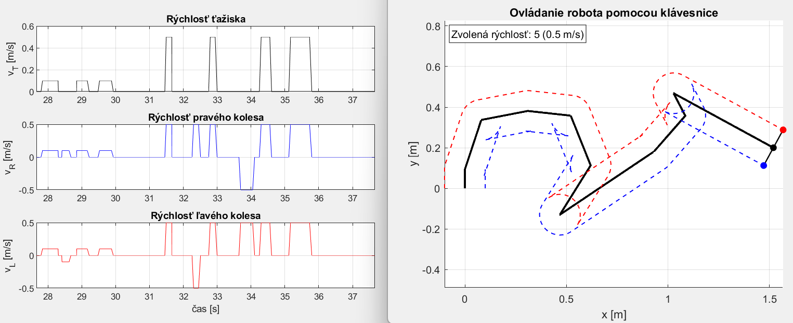

# Riadenie-robota-s-diferencialnym-podvozkom
Toto je moje vypracovanie tretieho zadania z predmetu Robotika. Sú tu riešenia riešenie štyroch úloh, ale najzaujímavejšia z toho je hra, v ktorej môže používateľ pomocou klávesnice ovládať dvojkolesového robota (niečo ako autíčko na ovládanie) s diferenciálnym podvozkom (taký podvozok ma napr. tank).
Ovládanie je intuitívne, pomocou kláves WASD, číslami 1 až 5 sa menia rýchlosti robota, medzerníkom sa zastavuje, ESC všetko zatvára.
Tu je nejaký screenshot ako návnada pre váhajúceho čitateľa:

Tu je celé [zadanie](Robzad3.pdf), tak ako sme to od cvičiaceho dostali.
V celom tomto zadaní vlastne išlo o to precvičiť a zafixovať si vzťahy pre diferenciálny podvozok, a samozrejme sa pri tom človek naučí dosť z Matlabu.
Tu sú moje Matlab kódy pre [prvú](zad3_uloha1.m), [druhú](zad3_uloha2.m) a [tretiu](zad3_uloha3.m) úlohu.
Tu je moja [dokumentácia](zad3_dokumentacia.pdf), kde sú moje myšlienkové pochody a proces riešenia podľa mňa celkom pekne zhrnuté.
Dávam sem aj [video](robZad3.mp4) (velkost) nech sa pozrie aj niekto, kto nemá Matlab.
